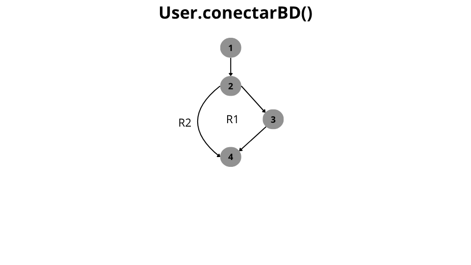
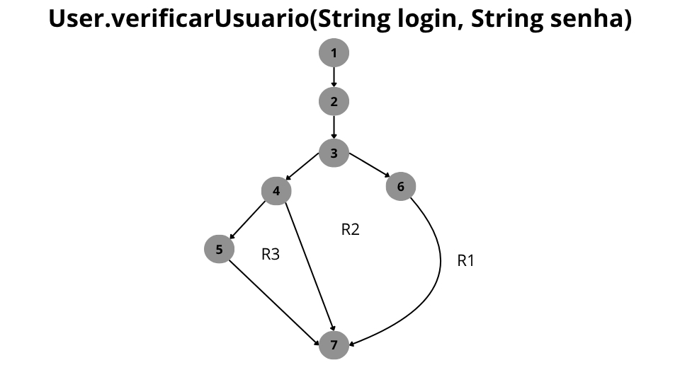

# Atividade individual de teste de caixa branca

Professor Daniel Ohata, notei que na atividade não estava escrito que precisava de dois grafos de fluxo. Entretanto,  
na minha cabeça não faz sentido representar **UM** grafo de fluxo para a classe inteira, até porquê o grafo  
de fluxo representa um algoritmo, e por ser um algoritmo, eu já pressuponho que, ele necessariante vai ter uma  
única saida pois ele tem que ter um objetivo.

Nesse sentido, eu elaborei 2 grafos de fluxo. Um grafo para a função User.conectarBD() e outra para  
User.conectarBD():

Complexidade ciclomática:  
E: 4 - N: 4 - P: 1  
M = E - N + 2p  
M = 4 - 4 + 2.1
M = 2

Caminhos Únicos:
Caminho 1 = 1; 2; 3; 4.  
Caminho 2 = 1; 2; 4.

User.verificarUsuario(String login, String senha):

Complexidade ciclomática:
E: 8 - N: 7 - P: 1
M = E - N + 2p
M = 8 - 7 + 2
M = 3

Caminhos Únicos:
Caminho 1: 1 - 2 - 3 - 6 - 7
Caminho 2: 1 - 2 - 3 - 4 - 7
Caminho 3: 1 - 2 - 3 - 4 - 5 - 7
